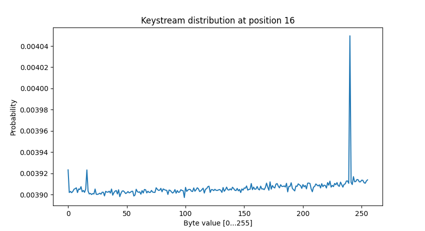
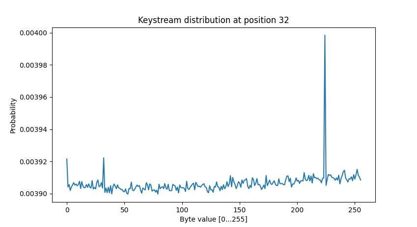

# Set 7: Hashes

## Table of contents
49. [Challenge 49 - CBC-MAC Message Forgery](#challenge-49---cbc-mac-message-forgery)
50. [Challenge 50 - Hashing with CBC-MAC](#challenge-50---hashing-with-cbc-mac)
51. [Challenge 51 - Compression Ratio Side-Channel Attacks](#challenge-51---compression-ratio-side-channel-attacks)
52. [Challenge 52 - Iterated Hash Function Multicollisions](#challenge-52---iterated-hash-function-multicollisions)
53. [Challenge 53 - Kelsey and Schneier's Expandable Messages](#challenge-53---kelsey-and-schneiers-expandable-messages)
54. [Challenge 54 - Kelsey and Kohno's Nostradamus Attack](#challenge-54---kelsey-and-kohnos-nostradamus-attack)
55. [Challenge 55 - MD4 Collisions](#challenge-55---md4-collisions)
56. [Challenge 56 - RC4 Single-Byte Biases](#challenge-56---rc4-single-byte-biases)


## Challenge 49 - CBC-MAC Message Forgery

> Challenge: https://cryptopals.com/sets/7/challenges/49

We create the CBC-MAC functionality:
```python
class CbcMac:
    @staticmethod
    def sign(msg: bytes, key: bytes, iv: bytes) -> bytes:
        c = aes_cbc_encrypt(plaintext=msg, key=key, nonce=iv, add_padding=True)
        return c[-AES_BLOCK_SIZE:]

    @staticmethod
    def verify(msg: bytes, sig: bytes, key: bytes, iv: bytes) -> bool:
        c = aes_cbc_encrypt(plaintext=msg, key=key, nonce=iv, add_padding=True)
        return sig == c[-AES_BLOCK_SIZE:]
```

Next, we create the API Server and the web client.

Note: 
    
- The Server and WebClient share a secret key.
    
- WebClient uses user_id=1 which is the identity of the attacker. That way, the attacker can generate valid messages only for the accounts he controls.

```python
class Server:
    def __init__(self, key: bytes):
        self._key = key

    def process_request(self, request: Request) -> bool:
        # verify request
        auth = CbcMac.verify(request.msg, request.mac, self._key, request.iv)
        if not auth:
            print('SERVER: Authentication Failed!')
            return False

        # execute request
        print(f'SERVER: transfer approved - {request.msg.decode()}')
        return True


class WebClient:
    def __init__(self, key: bytes):
        self._key = key
        self.user_id = 1  # the attacker ID

    def generate_request(self, to: int, amount: int) -> Request:
        # generate IV for current request
        iv = get_random_bytes(AES_BLOCK_SIZE)

        # encode the message
        msg = f'from=#{self.user_id:02d}&to=#{to:02d}&amount=#{amount}'.encode()
        mac = CbcMac.sign(msg=msg, key=self._key, iv=iv)
        return Request(msg=msg, iv=iv, mac=mac)
```

Now, as the attacker, we want to craft legitimate requests with our choice of parameters.

In this case, the attacker has control over the IV, and thus full control over the first block of the message.

```python
def gen_attack_request(web_client: WebClient, req_from: int, req_to: int, req_amount: int):
    # create legitimate request
    old_request = web_client.generate_request(to=req_to, amount=req_amount)
    old_msg = old_request.msg
    old_iv = old_request.iv

    # modify first block of the message to alter 'from'
    idx_start = old_msg.index(b'#')
    new_msg = bytearray(old_msg)
    new_msg[idx_start:idx_start + 2] = f'{req_from:02d}'.encode()

    new_iv = xor_bytes((old_iv, old_msg[:AES_BLOCK_SIZE], new_msg[:AES_BLOCK_SIZE]))

    # pack attack request
    attack_request = Request(msg=bytes(new_msg), iv=new_iv, mac=old_request.mac)
    return attack_request
```

And the results:
```python
# server and web-client shared key
key = get_random_bytes(AES_BLOCK_SIZE)
server = Server(key)
web_client = WebClient(key)

# generate invalid request
attack_request = gen_attack_request(web_client, req_from=3, req_to=1, req_amount=1000000)

# send the fake request to the server
server.process_request(attack_request)  # SERVER: transfer approved - from=#03&to=#01&amount=#1000000
```

---

Now, the IV is fixed, and the attacker can't use it to forge messages.

We update WebClient and add support for multiple transactions in a single request:
```python
class WebClient:
    def __init__(self, key: bytes):
        self._key = key

    def generate_request(self, user_id: int, transactions: list[tuple[int, int]]) -> Request:
        # encode the message
        transactions = ';'.join([f'{to:02d}:{amount}' for to, amount in transactions])
        msg = f'from=#{user_id:02d}&tx_list=#{transactions}'.encode()
        mac = CbcMac.sign(msg=msg, key=self._key, iv=bytes(AES_BLOCK_SIZE))
        return Request(msg=msg, mac=mac)
```

Our goal is to add a transaction paying the attacker's account 1M spacebucks.

Assume we can capture a valid message from the target user. 

The message will have the form: `from=#TARGET_ID&tx_list=#{transactions}`

As the attacker, we can generate a valid message of the form: `from=#ATTACKER_ID_ID&tx_list=#{transactions}`

We will use a length extension attack to combine these two messages.

Imagine the target message blocks are:

TM0 | TM1 | TM2

And the corresponding cipher blocks:

CT0 = E(TM0 + IV) | CT1 = E(TM1 + CT0) | MAC_T = CT2 = E(TM2 + CT1)

In the same way, the attacker message and cipher blocks:

AM0 | AM1 | AM2

CA0 = E(AM0 + IV) | CA1 = E(AM1 + CA0) | MAC_A = CA2 = E(TA2 + CA1)

We can forge the following message:

TM0 | TM1 | padd(TM2) | AM0 + MAC_T | AM1 | AM2

And its CBC MAC will be the same as MAC_A.

```python
def gen_attack_request(target_request: Request, attacker_request: Request):
    target_msg = pkcs7_pad(target_request.msg, AES_BLOCK_SIZE)
    attacker_msg = attacker_request.msg

    # create new message by length extension
    overlap_block = xor_bytes((target_request.mac, attacker_msg[:AES_BLOCK_SIZE]))
    new_msg = target_msg + overlap_block + attacker_msg[AES_BLOCK_SIZE:]

    # pack request
    return Request(msg=new_msg, mac=attacker_request.mac)
```

We can use the attack in the following way:
```python
ATTACKER_ID = 1
TARGET_ID = 2

# server and web-client shared key
key = get_random_bytes(AES_BLOCK_SIZE)
server = Server(key)
web_client = WebClient(key)

# capture a valid message from your target user
target_request = web_client.generate_request(user_id=TARGET_ID, transactions=[(6, 789), (9, 321)])

# use length extension to add a transaction paying the attacker's account 1M.
attacker_request = web_client.generate_request(user_id=ATTACKER_ID, transactions=[(ATTACKER_ID, 1000000)])
forged_request = gen_attack_request(target_request, attacker_request)

# send the fake request to the server
server.process_request(forged_request)

## SERVER: transfer approved - b'from=#02&tx_list=#06:789;09:321\x011\xe7\x8aK\x8ar\x83\x8a\x8e1Q;j\x05\xebE=#01:1000000'
```

As we can see, the *overlap_block* has no meaning, but we were able to add a transaction to the end of the list.


## Challenge 50 - Hashing with CBC-MAC

> Challenge: https://cryptopals.com/sets/7/challenges/50

We have the following JS snippet: `alert('MZA who was that?');`

With CBC-MAC = `296b8d7cb78a243dda4d0a61d33bbdd1`

Our goal is to create a JS snippet that alerts "Ayo, the Wu is back!" and hashes to the same value.

We can use a length extension attack as we did in the last challenge - building a message that starts with our new message and appending the previous message, such that the MAC is preserved.

We start with the desired snippet (the comment allows us to append the snippet without affecting the execution):
```python
# forged mac
new_msg = b"alert('Ayo, the Wu is back!');" + b'//'
```

Now, we look for a block to append the msg which will result in ASCII compliance:
```python
while True:
    suffix = bytes([random.randint(33, 127) for _ in range(AES_BLOCK_SIZE)])
    tmp_iv = aes_cbc_encrypt(new_msg + suffix, key=key, add_padding=False)[-AES_BLOCK_SIZE:]
    overlap_block = xor_bytes((tmp_iv, msg[:AES_BLOCK_SIZE]))
    try:
        overlap_block.decode('ascii')
        break
    except UnicodeDecodeError:
        continue
```

Then, we create the full snippet:
```python
final_msg = new_msg + suffix + overlap_block + msg[AES_BLOCK_SIZE:]
assert CbcMac.verify(final_msg, sig=mac, key=key, iv=bytes(AES_BLOCK_SIZE))

print(final_msg.decode('ascii'))
# alert('Ayo, the Wu is back!');//B_z\qFTES^$%FzFm2=rf|(vJ@jG*las that?');
```


## Challenge 51 - Compression Ratio Side-Channel Attacks

> Challenge: https://cryptopals.com/sets/7/challenges/51

The challenge is based on the paper [BREACH: REVIVING THE CRIME ATTACK](https://www.breachattack.com/resources/BREACH%20-%20SSL,%20gone%20in%2030%20seconds.pdf).

We create the Compression Oracle. 

The Oracle format the data with http header, compress the request, encrypt it and return the resulting length:
```python
SESSION_ID = 'TmV2ZXIgcmV2ZWFsIHRoZSBXdS1UYW5nIFNlY3JldCE='

class CompressionOracle:
    def __init__(self, enc_type: Literal['CTR', 'CBC']):
        self.enc_type = enc_type

    def gen_request(self, data: str):
        # format the request
        request = self._format_request(data)

        # compress request
        request = zlib.compress(request)

        # encrypt with random key / IV
        key = get_random_bytes(AES_BLOCK_SIZE)
        nonce = get_random_bytes(AES_BLOCK_SIZE // 2)

        if self.enc_type == 'CTR':
            request = AesCtr(key=key, nonce=nonce).encrypt(request)
        elif self.enc_type == 'CBC':
            request = aes_cbc_encrypt(request, key=key, nonce=nonce, add_padding=True)
        else:
            raise ValueError

        # return the byte length of the request
        return len(request)

    @staticmethod
    def _format_request(data: str) -> bytes:
        """ Format of the request """
        request = 'POST / HTTP/1.1\n'
        request += 'Host: hapless.com\n'
        request += f'Cookie: sessionid={SESSION_ID}\n'
        request += f'Content-Length: {len(data)}\n'
        request += f'{data}'

        return request.encode()
```

Our target is to evaluate the *sessionid*.

We use Compression Side Channel Attacks:

*In compression algorithms any phrase that is repeated gets stored once. This means that if a certain string of characters is repeated somewhere in the text, it is only stored the first time. The second time it occurs as a reference to the first occurrence, therefore when a text occurs multiple times it is very efficiently compressed so the size is smaller. This characteristic can be used in a compression side-channel attack.* (https://www.venafi.com/blog/what-are-compression-side-channel-attacks)

So, when the encryption is a stream cipher, the length of the response reveals the exact plain text length. To decode the sessionid, we loop one byte at a time and look for the shortest encryption. (To avoid outlier cases, we make sure only one byte corresponds to the shortest length):
```python
def decode_session_id(oracle: CompressionOracle):
    # consts
    prefix = 'sessionid='
    alphabet = string.ascii_uppercase + string.ascii_lowercase + string.digits + '+/=' + '\n'
    max_len = 100
    max_attempts = 15

    # output string
    session_id = prefix

    # decode each character at a time
    for _ in range(max_len):
        for shift in range(max_attempts):
            # find minimum compression length
            len_list = [oracle.gen_request(session_id[shift:] + new_chr) for new_chr in alphabet]
            min_len = min(len_list)
            chr_list = [alphabet[idx] for idx, comp_len in enumerate(len_list) if comp_len == min_len]

            # check uniqueness
            if len(chr_list) == 1:
                break

        new_chr = chr_list[0]
        # assume [session_id] ends with '\n'
        if new_chr == '\n':
            break

        # update output string
        session_id += new_chr

    return session_id[len(prefix):]
```

And it looks like its working:
```python
# stream cipher (CTR)
oracle_ctr = CompressionOracle(enc_type='CTR')
session_id = decode_session_id(oracle_ctr)
assert session_id == SESSION_ID
```

---
Now, we use CBC (Block Cipher) to encrypt the response. This time, the response may not be aligned at the end of the block, and the block will hide the exact plain text length.

To deal with it, we align the response to a tipping point, by brute-forcing all possible padding lengths.

The updated *decode_session_id* become:
```python
def decode_session_id(oracle: CompressionOracle):
    # consts
    prefix = 'sessionid='
    alphabet = string.ascii_uppercase + string.ascii_lowercase + string.digits + '+/=' + '\n'
    max_len = 100
    max_shift = 2

    # output string
    session_id = prefix

    # decode each character at a time
    for _ in range(max_len):
        for shift, pad_len in product(range(max_shift), range(AES_BLOCK_SIZE)):
            # find minimum compression length
            padding = string.ascii_uppercase[:pad_len]
            len_list = [oracle.gen_request(padding + session_id[shift:] + new_chr) for new_chr in alphabet]
            min_len = min(len_list)
            chr_list = [alphabet[idx] for idx, comp_len in enumerate(len_list) if comp_len == min_len]

            # check uniqueness
            if len(chr_list) == 1:
                break

        new_chr = chr_list[0]
        # assume [session_id] ends with '\n'
        if new_chr == '\n':
            break

        # update output string
        session_id += new_chr

    return session_id[len(prefix):]
```

And it works too:
```python
# block cipher (CBC)
oracle_cbc = CompressionOracle(enc_type='CBC')
session_id = decode_session_id(oracle_cbc)
assert session_id == SESSION_ID
```


## Challenge 52 - Iterated Hash Function Multicollisions

> Challenge: https://cryptopals.com/sets/7/challenges/52

The challenge is based on the paper [Multicollisions in iterated hash functions](https://www.iacr.org/archive/crypto2004/31520306/multicollisions.pdf).

We implement Merkle-Damgard hash function:
```python
def merkle_damgard_aes128(msg: bytes, state: bytes, state_size: int) -> bytes:
    if len(state) != state_size:
        raise ValueError(f'H must have length of {state_size}')

    # pad the message
    reminder = len(msg) % AES.block_size
    if reminder > 0:
        msg += bytes(AES.block_size - reminder)

    # loop message blocks
    for i in range(0, len(msg), AES.block_size):
        # pad H to key size
        assert len(state) == state_size
        state += bytes(AES.block_size - len(state))

        # encrypt
        msg_block = msg[i:i + AES.block_size]
        state = AES.new(state, AES.MODE_ECB).encrypt(msg_block)
        state = state[:state_size]

    return state
```

Now, we need to create a function f(n) that will generate 2^n collisions in this hash function.

According to the [Birthday Paradox](https://en.wikipedia.org/wiki/Birthday_problem), The naive approach of brute-forcing the search will result in $\Theta(2^{n} \cdot 2^{b \cdot (2^{n}-1) / 2^{n}})$ guesses in average (where b is the bit-size of the hash function).

To narrow down the search, we use [Joux’s multicollision attack](https://cs.uwaterloo.ca/~dstinson/Pyth4.pdf).

The idea is to find $n$ successive collisions in the compression function, each of which requires time $\Theta(2^{b/2})$, resulting in a total of $\Theta(n \cdot 2^{b/2})$ .

The attack: we find the following collisions (total of n collisions) - 

$$ z_{1} = C(y_{1}^{1}, z_{0}) = C(y_{1}^{2}, z_{0}) $$

$$ z_{2} = C(y_{2}^{1}, z_{1}) = C(y_{2}^{2}, z_{1}) $$

$$ ... $$

$$ z_{n} = C(y_{n}^{1}, z_{n-1}) = C(y_{n}^{2}, z_{n-1}) $$

Then, the set:

$$ \{y_{1}^{1},y_{1}^{2}\} \times \{y_{2}^{1},y_{2}^{2}\} \times ... \times \{y_{n}^{1},y_{n}^{2}\} $$ 

is a $2^{n}$ multicollision.

For the attack, we need a function that searches for a single collision in $\Theta(2^{b/2})$ time. ([more about the function comlexity](https://www.learnpythonwithrune.org/birthday-paradox-and-hash-function-collisions-by-example/))
```python
def find_collision(state: bytes, state_size: int):
    """
    Find two messages that collide
    :param state: previous state
    :param state_size: state size in bytes
    :return: (first message, second message, next state)
    """
    if len(state) != state_size:
        raise ValueError(f'state must have length of {state_size}')

    hash_dict = {}
    while True:
        msg = random.randbytes(AES.block_size)
        hash_result = merkle_damgard_aes128(msg, state, state_size)

        # check for collision
        if hash_result in hash_dict:
            return msg, hash_dict[hash_result], hash_result
        else:
            hash_dict[hash_result] = msg
```

And then, we can use the described method to generate multiple collisions:
```python
def generate_collisions(n: int, state: bytes, state_size: int):
    """ Create a 2^n multi collision set """
    msg_set = []
    for _ in range(n):
        y1, y2, state = find_collision(state, state_size)
        msg_set.append((y1, y2))

    # return msg_set
    for i in product([0, 1], repeat=n):
        yield b''.join([block[i[idx]] for idx, block in enumerate(msg_set)])
```

Finally, we can check all the messages indeed collide:
```python
# generate collisions and verify all messages collide
n = 4  # look for 2^n collisions
state_size = 2  # state size in bytes
initial_state = random.randbytes(state_size)
msg_set = generate_collisions(n, initial_state, state_size)
hash_vals = [merkle_damgard_aes128(msg, initial_state, state_size) for msg in msg_set]
all_collide = hash_vals.count(hash_vals[0]) == len(hash_vals)
print(f'{all_collide=}')  # all_collide=True
```

---

In the second part of the challenge, we need to find collision to h(x) = f(x) || g(x).

Instead of looking for collisions in h(x), we can generate collisions in f(x) (the cheaper hash function) and check for collision in g(x).

We use f(x) with output size of 16 bits, and g(x) with output size of 32 bit:
```python
# define f and g:
b1 = 2  # f state_size
b2 = 4  # g state_size

# initial states
f_initial_state = random.randbytes(b1)
g_initial_state = random.randbytes(b2)

# define h = f|g
def h(msg: bytes):
    f = merkle_damgard_aes128(msg=msg, state=f_initial_state, state_size=b1)
    g = merkle_damgard_aes128(msg=msg, state=g_initial_state, state_size=b2)
    return f + g

# look for collision in h(x) = f(x) || g(x)
found_collision = False
while not found_collision:
    # generate colliding messages in f
    f_msg_set = generate_collisions(n=b2*3, state=f_initial_state, state_size=b1)

    # there's a good chance the message pool has a collision in g - find it
    hash_dict = {}
    for msg in f_msg_set:
        hash_result = merkle_damgard_aes128(msg=msg, state=g_initial_state, state_size=b2)

        # check for collision
        if hash_result in hash_dict:
            m1, m2 = msg, hash_dict[hash_result]
            found_collision = True
            break
        else:
            hash_dict[hash_result] = msg

# verify the hash h(x) collide
is_collision = h(m1) == h(m2)
print(f'{is_collision=}')  # is_collision=True
```

There were 400 calls to the collision function.


## Challenge 53 - Kelsey and Schneier's Expandable Messages

> Challenge: https://cryptopals.com/sets/7/challenges/53

The challenge is based on the paper [Second Preimages on n-bit Hash Functions for Much Less than 2^n Work](https://www.schneier.com/wp-content/uploads/2016/02/paper-preimages.pdf).

We update Merkle-Damgard hash function to have secure padding:
```python
def merkle_damgard_aes128(msg: bytes, state: bytes, state_size: int, add_len_pad: bool = True) -> bytes:
    if len(state) != state_size:
        raise ValueError(f'H must have length of {state_size}')

    # pad the message, use secure padding:
    # (https://en.wikipedia.org/wiki/Merkle%E2%80%93Damg%C3%A5rd_construction#Length_padding_example)
    reminder = len(msg) % AES.block_size
    msg_len = len(msg)
    if reminder > 0:
        msg += b'\x80'  # first bit in padding is 1
        msg += bytes(AES.block_size - reminder - 1)  # zeros to match block size

    if add_len_pad:
        # the message length is added in an extra block at the end
        msg += msg_len.to_bytes(AES.block_size, 'big')

    # loop message blocks
    for i in range(0, len(msg), AES.block_size):
        # pad H to key size
        assert len(state) == state_size
        state += bytes(AES.block_size - len(state))

        # encrypt
        msg_block = msg[i:i + AES.block_size]
        state = AES.new(state, AES.MODE_ECB).encrypt(msg_block)
        state = state[:state_size]

    return state
```

For the attack, we need to implement *Expandable Message*. This is actually a set of messages of length $(k, k + 2^{k} - 1)$ with the same hash value.

Using these messages, we can choose a prefix with a length of our own choice with a known hash result.

We start with a function that finds a collision between 1-block message and a message of $\alpha = 2^{(k-j)}+1$ blocks.

Note - this function has to be efficient (birthday paradox), otherwise the whole search would be pointless and we would get stuck here. 

For efficiency, we constructs about $2^{n/2}$ messages of length
1, and about the same number of length $\alpha$ , and looks for a collision:
```python
def find_collision(state: bytes, k: int, j: int):
    """
    Find a collision between a single-block message and a message of 2^(k-j)+1 blocks.
    :return: (1-block message, 2^(k-j)+1 block message, next state)
    """

    n = len(state) * 8  # state length in bits

    one_block_hash = {}
    while True:
        # constructs about 2^(n/2) messages of length 1
        for _ in range(n//2+1):
            msg = random.randbytes(AES.block_size)
            msg_hash = merkle_damgard_aes128(msg, state, len(state), add_len_pad=False)
            one_block_hash[msg_hash] = msg

        # find collision with messages of length 2^(k-j)+1
        prefix = random.randbytes(AES.block_size * (2 ** (k - j)))
        prefix_hash = merkle_damgard_aes128(prefix, state, len(state), add_len_pad=False)

        for _ in range(n//2+1):
            last_block = random.randbytes(AES.block_size)
            hash_result = merkle_damgard_aes128(last_block, prefix_hash, len(prefix_hash), add_len_pad=False)

            # check for collision
            if hash_result in one_block_hash:
                m1 = one_block_hash[hash_result]
                m2 = prefix + last_block
                hash_out = hash_result

                assert len(m1) == AES.block_size
                assert len(m2) == AES.block_size * (2 ** (k-j) + 1)
                assert merkle_damgard_aes128(m1, state, len(state), add_len_pad=False) == hash_out
                assert merkle_damgard_aes128(m2, state, len(state), add_len_pad=False) == hash_out
                return m1, m2, hash_out
```

Then, we create *ExpandableMessage* class which generates the discussed set, and produce a message with a length of our own choice:
```python
class ExpandableMessage:
    def __init__(self, k: int, initial_state: bytes):
        """ Produce a set of messages of length (k, k + 2^k - 1) """
        msg_set = []
        state = initial_state
        for j in range(1, k + 1):
            m1, m2, state = find_collision(state, k, j)
            msg_set.append((m1, m2))

        self.k = k
        self.initial_state = initial_state
        self.msg_set = msg_set
        self.hash = state

    def generate_msg(self, num_blocks: int) -> bytes:
        """ Generate msg of [n] blocks """
        if num_blocks < self.k or num_blocks > (self.k + 2 ** self.k - 1):
            raise ValueError('n is out of bounds')

        # build the message using binary representation
        num_added_blocks = num_blocks - self.k
        seq = [1 if digit == '1' else 0 for digit in format(num_added_blocks, f'0{self.k}b')]
        msg = b''.join([block[seq[idx]] for idx, block in enumerate(self.msg_set)])

        # validate message
        assert len(msg)/AES.block_size == num_blocks

        return msg
```

Now, the attack goes like this:
- Save the hash value of intermediate blocks of the message.
- Find a collision between a *bridged* block to one of the saved hash values from the previous step.
- Build a forged message with the length of the original message. The forged message contains a prefix (which derives from the expandable message), the bridged block, and the second part of the original image.

```python
def preimage_attack(msg: bytes, initial_state: bytes):
    # Generate an expandable message
    k = math.floor(math.log2(len(msg)/AES.block_size))
    expandable_msg = ExpandableMessage(k=k, initial_state=initial_state)

    # generate a map of intermediate hash states to the block indices that they correspond to
    hash_states = {}
    state = initial_state
    state_size = len(initial_state)
    for i in range(0, len(msg), AES.block_size):
        # pad H to key size
        state += bytes(AES.block_size - len(state))

        # encrypt
        msg_block = msg[i:i + AES.block_size]
        if len(msg_block) != AES.block_size:
            break
        state = AES.new(state, AES.MODE_ECB).encrypt(msg_block)
        state = state[:state_size]

        # add state to table
        if i >= (k-1) * AES.block_size:
            hash_states[state] = i

    # find a single-block "bridge" to intermediate state in the map
    while True:
        bridge_block = random.randbytes(AES.block_size)
        next_state = merkle_damgard_aes128(bridge_block, expandable_msg.hash, state_size, add_len_pad=False)
        if next_state in hash_states:
            suffix_idx = hash_states[next_state] + AES.block_size
            break

    # generate a prefix of the right length such that len(prefix || bridge || M[i..]) = len(M)
    suffix = msg[suffix_idx:]
    prefix_len = (len(msg) - len(suffix)) // AES.block_size - 1
    prefix = expandable_msg.generate_msg(num_blocks=prefix_len)

    # generate the fake message
    forged_msg = prefix + bridge_block + msg[suffix_idx:]

    # check validity
    assert len(forged_msg) == len(msg)
    assert merkle_damgard_aes128(msg, initial_state, state_size) ==\
           merkle_damgard_aes128(forged_msg, initial_state, state_size)

    return forged_msg
```

Using *preimage_attack* we can forge preimage for any long message:
```python
# generate source message and hash
k = 8
msg = random.randbytes(AES.block_size * (2 ** k) + 19)

state_size = 4    # state size in bytes
initial_state = random.randbytes(state_size)
msg_hash = merkle_damgard_aes128(msg, initial_state, state_size)

# forge message
forged_msg = preimage_attack(msg, initial_state)
assert merkle_damgard_aes128(forged_msg, initial_state, state_size) == msg_hash
```

We found a collision for a state of 32-bit long in just a few seconds !!! 

Using a naive approach would require $2^n = 4,294,967,296$ iterations.


## Challenge 54 - Kelsey and Kohno's Nostradamus Attack

> Challenge: https://cryptopals.com/sets/7/challenges/54

The challenge is based on the paper [Herding Hash Functions and the Nostradamus Attack](https://link.springer.com/chapter/10.1007/11761679_12).

Kelsey and Kohno (2006) described the following hash function property, presented as a game between an attacker and a challenger:

*Chosen-target-forced-prefix resistance - An attacker commits to a message digest, z, and is then challenged with a prefix, P. It should be infeasible for the attacker to be able to find a suffix S such that hash(P k S) = z.* ([source](https://cs.uwaterloo.ca/~dstinson/Pyth4.pdf))

In this challenge, we implement an attack that violates CTFP resistance against Merkle-Damgard hash functions (often called a herding attack).

The attack uses a precomputed data structure called a diamond structure: 
- A 2^k-diamond structure contains a complete binary tree of depth k. 
- Every edge $e$ in the diamond structure is labeled by a string $σ(e)$ and consist one message block.
- Each node $N$ in the structure correspond to the hash of the concatenated messages on the path from the source node to the node $N$ in the diamond structure.
- At any level $l$ of the structure there are $2^{k−l}$ hash values.
- These values must be paired, such that, when the next message blocks are appended, $2^{k−l−1}$ collisions occur.

We implement the structure computation:
```python
def build_diamond_structure(k: int, state_size: int) -> (list[StateNode], bytes):
    """
    Build the diamond structure
    :param k: number of levels in the tree
    :param state_size: hash func output size
    :return: - list of [StateNode] with the tree leaves
             - state of root node
    """
    # Generate 2^k initial hash states
    initial_states = [StateNode(random.randbytes(state_size)) for _ in range(2**k)]

    state_list = initial_states
    # build the tree one level at a time (starting from leaves)
    for _ in range(k):
        next_state_list = []
        # Pair the states and generate single-block collisions
        for idx in range(0, len(state_list), 2):
            node1, node2 = state_list[idx], state_list[idx+1]
            m1, m2, hash_out = find_collision(node1.state, node2.state)

            # update the tree structure
            new_node = StateNode(hash_out)
            next_state_list.append(new_node)
            node1.msg, node2.msg = m1, m2
            node1.next_node, node2.next_node = new_node, new_node

        # update node list for next level
        state_list = next_state_list

    return initial_states, state_list[0].state
```

We used the function *find_collision* which is implemented as follows:
```python
def find_collision(state1: bytes, state2: bytes):
    """
    Find a collision between two single-block messages from different initial states
    :return: (block message 1, block message 2, next state)
    """

    if len(state1) != len(state2):
        raise ValueError('both states must have the same length')

    n = len(state1) * 8  # state length in bits

    block1_hash = {}
    while True:
        # constructs about 2^(n/2) messages from state1
        for _ in range(n//2):
            msg1 = random.randbytes(AES.block_size)
            msg1_hash = merkle_damgard(msg1, state1, len(state1), add_len_pad=False)
            block1_hash[msg1_hash] = msg1

        # find collision with messages from state2
        for _ in range(n//2):
            msg2 = random.randbytes(AES.block_size)
            msg2_hash = merkle_damgard(msg2, state2, len(state2), add_len_pad=False)

            # check for collision
            if msg2_hash in block1_hash:
                m1 = block1_hash[msg2_hash]
                m2 = msg2
                hash_out = msg2_hash

                assert len(m1) == len(m2) == AES.block_size
                assert merkle_damgard(m1, state1, len(state1), add_len_pad=False) == hash_out
                assert merkle_damgard(m2, state2, len(state2), add_len_pad=False) == hash_out
                return m1, m2, hash_out
```

Back to our problem of *proof of a secret prediction*:

- We commit to the hash value that appears at the root of the diamond structure (after padding the message length).
- Then, a challenger provides a prefix $P$.
- We generate glue blocks such that the last block collides with one of the leaves in the tree.
- Finally, we follow the path from the leaf all the way up to the root node, and build the prediction using the message blocks along the way.

```python
class Prognosticating:
    def __init__(self, k: int, initial_state: bytes, max_msg_blocks: int):
        self.k = k
        self.initial_state, self.state_size = initial_state, len(initial_state)
        self.max_msg_blocks = max_msg_blocks
        self.diamond_leaves, self.root_state = build_diamond_structure(k, self.state_size)

    def get_hash_prediction(self):
        """ Compute the padded hash value we commit """
        # create padding block
        prediction_len = (self.max_msg_blocks + 1 + self.k) * AES.block_size
        padding_block = prediction_len.to_bytes(AES.block_size, 'big')

        # find finale hash
        hash_prediction = merkle_damgard(padding_block, self.root_state, len(self.root_state), add_len_pad=False)
        return hash_prediction

    @timeit
    def generate_prediction(self, prefix: bytes):
        """ Generate a prediction containing given [prefix] """
        # validate prefix max length
        if math.ceil(len(prefix) / AES.block_size) > self.max_msg_blocks:
            raise ValueError('prefix is too long')

        # pad the prefix to match multiply of block size
        reminder = len(prefix) % AES.block_size
        if reminder > 0:
            prefix += bytes(AES.block_size - reminder)

        # find collision with one of the tree leaves
        prefix_hash = merkle_damgard(prefix, self.initial_state, self.state_size, add_len_pad=False)
        while True:
            link_msg = random.randbytes(AES.block_size)
            tmp_hash = merkle_damgard(link_msg, prefix_hash, self.state_size, add_len_pad=False)

            leaf = next((x for x in self.diamond_leaves if x.state == tmp_hash), None)
            if leaf is not None:
                break

        # build message
        msg = prefix + link_msg
        tmp_node = leaf
        while tmp_node.next_node is not None:
            msg += tmp_node.msg
            tmp_node = tmp_node.next_node

        return msg
```

Using *Prognosticating*, we can fake a secret prediction:
```python
k = 9  # number of levels in the diamond structure
state_size = 4  # state size in bytes
initial_state = random.randbytes(state_size)

# create proof of a secret prediction
prognosticating = Prognosticating(k=k, initial_state=initial_state, max_msg_blocks=2)
hash_prediction = prognosticating.get_hash_prediction()
print(f'Published hash: {hash_prediction}')  # Published hash: b'\xdb5e\xa1'

# generate prediction
challenger_prefix = b'Team ABC won with 30 points'
prediction = prognosticating.generate_prediction(challenger_prefix)
print(f'Prediction: {prediction}')  # Prediction: b'Team ABC won with 30 points\x00\x00\x00\x00\x00Mij\x85\xed\xdcO}\r6u\x8f\x83\x93\xa1X\x887\x01\xad=\x86lR\xdaA\x91\xd3\x1e&R\x10SK\x07\x19\xa2@\x06\x11ss6\xf3E<\xf7e\x83\xf6lK\xe6\xe5\xbc\xa6_o\xe1\xc2\x0f\xf1v\x0b\xc2c\xa36J\xd1\r\xcf\xfczl\x02%\xca\x87\x1d\xe7\\@6\xe7\xea\xff\x04\xeb\xb9\xeb\xbcl\x81(\x99\xc4Q\x18i\xe3}\x8f\xd2\xc3\x0b(\xe0\xb9\xe0\x9c\x1e\xfeY\xd7\xde\x04=g\xa7/\x05\x9a\x15\xa4\xfeS\xe8\x1b\x081\xa5\xef0?\xd1o\xdd\x1b\x83\x01I\x8d\x9d\xba\x0f\xeaa\x0c\xcfm-\x05\x0c]\x9c9]5\xee'

# verify result
real_prediction_hash = merkle_damgard(prediction, initial_state, state_size)
print(f'Prediction hash: {real_prediction_hash}')  # Prediction hash: b'\xdb5e\xa1'
assert real_prediction_hash == hash_prediction
```

Note that the suffix length is only $k+1$ blocks long.


## Challenge 55 - MD4 Collisions

> Challenge: https://cryptopals.com/sets/7/challenges/55

The challenge is based on the paper [Cryptanalysis of the Hash Functions MD4 and RIPEMD](https://link.springer.com/chapter/10.1007/11426639_1).

(*Fort & Forge* wrote an excellent [writeup](https://fortenf.org/e/crypto/2017/09/10/md4-collisions.html) for this challenge)

In this challenge we find MD4 collisions using Wang's attack. Given a message block M, Wang outlines a strategy for finding a sister message block M', differing only in a few bits, that will collide with it. Just so long as a short set of conditions holds true for M.

The attack starts with generating a *weak message* according to Wang demands (Table. 6 in the paper).

### Single-Step Modification
In Round 1, each state variable depends on a different message block, and we can modify each state variable without affecting the others.

For example, we have the following constraints on c1:
`c1,7 = 1, c1,8 = 1, c1,11 = 0, c1,26 = d1,26`

To enforce these constraints, we follow the steps:
- Compute the original value of c1

$$ c_{1} = \phi_{1}(c,d,a,b,m_{2},11) $$

- Correct the relevant bits of c1 to match the constraints

$$ c_{1,7}' = c_{1,7} \oplus (c_{1,7} \oplus 1) $$

$$ c_{1,8}' = c_{1,8} \oplus (c_{1,8} \oplus 1) $$

$$ c_{1,11}' = c_{1,11} \oplus (c_{1,11} \oplus 0) $$

$$ c_{1,26}' = c_{1,26} \oplus (c_{1,26} \oplus d_{1,26}) $$

- Evaluate the corresponding message block that will reproduce c1

$$ m_{2} = \phi_{1}^{-1}(c,d,a,b,c_{1}',11) $$


For the implementation of first-round constraints we create some helper functions:
```python
def phi1(a, b, c, d, m, s): return lrot(a + f(b, c, d) + m, s)
def phi1_inv(a, b, c, d, next_a, s): return (rrot(next_a, s) - a - f(b, c, d)) & 0xFFFFFFFF

def phi1_constrained(a, b, c, d, m, m_idx, s, constraints: list[Constraint]):
    # eval next a
    next_a = phi1(a, b, c, d, m[m_idx], s)

    # loop constraints
    for con in constraints:
        if con.type == 'eq':
            next_a ^= (next_a & (1 << con.src_bit)) ^ (b & (1 << con.src_bit))
        elif con.type == 'zero':
            next_a ^= (next_a & (1 << con.src_bit)) ^ 0
        elif con.type == 'one':
            next_a ^= (next_a & (1 << con.src_bit)) ^ (1 << con.src_bit)
        else:
            raise Exception

    # fix message block
    m[m_idx] = phi1_inv(a, b, c, d, next_a, s) & 0xFFFFFFFF
    return next_a
```

Then we can enforce the constraints like so (for example):
```python
# step 3: c1,7 = 1, c1,8 = 1, c1,11 = 0, c1,26 = d1,26
constraints = [Constraint(type='one', src_bit=6),
                Constraint(type='one', src_bit=7),
                Constraint(type='zero', src_bit=10),
                Constraint(type='eq', src_bit=25)]

c = phi1_constrained(c, d, a, b, m, 2, 11, constraints)
```

### Multi-Step Modification
The problem with Round 2 constraints is that they reuse message blocks from Round 1. That way, if we modify the message blocks to hold for Round 2 constraints, the state variables of Round 1 will be changed too.

To deal with that problem, we also modify successive message blocks, such that the following state variables will not change.

For example, to enforce a5 constraints, we need to modify m0. 

If we change m0, a1 will also get changed, and so the state variables that depend on it (d1, c1, b1, a2).

The solution is to modify (m1, m2, m3, m4) such that only a1 will get changed, but (d1, c1, b1, a2) will remain the same.

```python
# a5 constraints
a5 = phi2(a, b, c, d, m[0], 3)
a5 ^= (a5 & (1 << 18)) ^ (c & (1 << 18))  # a5,19 = c4,19
a5 ^= (a5 & (1 << 25)) ^ (1 << 25)  # a5,26 = 1
a5 ^= (a5 & (1 << 26)) ^ 0  # a5,27 = 0
a5 ^= (a5 & (1 << 28)) ^ (1 << 28)  # a5,29 = 1
a5 ^= (a5 & (1 << 31)) ^ (1 << 31)  # a5,32 = 1

# fix message block
m[0] = phi2_inv(a, b, c, d, a5, 3)
a_vec[1] = phi1(a_vec[0], b_vec[0], c_vec[0], d_vec[0], m[0], 3)

# update message according to the new state
m[1] = phi1_inv(d_vec[0], a_vec[1], b_vec[0], c_vec[0], d_vec[1], 7)
m[2] = phi1_inv(c_vec[0], d_vec[1], a_vec[1], b_vec[0], c_vec[1], 11)
m[3] = phi1_inv(b_vec[0], c_vec[1], d_vec[1], a_vec[1], b_vec[1], 19)
m[4] = phi1_inv(a_vec[1], b_vec[1], c_vec[1], d_vec[1], a_vec[2], 3)
```

### Finding Collision
After we have some *weak message*, we can use Wang condition to find a collision:

```python
def find_collision():
    while True:
        # generate weak message
        src = generate_weak_message()
        src_unpack = list(struct.unpack("<16I", src))

        # create collision message
        new_msg = src_unpack.copy()
        new_msg[1] = (new_msg[1] + (2 ** 31)) & 0xFFFFFFFF
        new_msg[2] = (new_msg[2] + (2 ** 31) - (2 ** 28)) & 0xFFFFFFFF
        new_msg[12] = (new_msg[12] - (2 ** 16)) & 0xFFFFFFFF
        new_msg = struct.pack("<16I", *new_msg)

        # check for collision
        hash1 = MD4.new(src).digest()
        hash2 = MD4.new(new_msg).digest()

        if hash1 == hash2:
            return src, new_msg, hash1
```

We run the following lines:
```python
m1, m2, hash_collision = find_collision()
print(f'{m1.hex()=}') 
print(f'{m2.hex()=}')
print(f'{hash_collision.hex()=}')
```
 And we find MD4 collision in just a few seconds !!!

``` python
m1.hex()='122d89dcf3c93c0f6d9c5493ed9f11f23f7b7cbe648f6c262f45439b4b0a8d0ca35c8066931ac2e33b7f0bf4b906d4bf324b00ddb375c20a207793f1977718c5'
m2.hex()='122d89dcf3c93c8f6d9c5403ed9f11f23f7b7cbe648f6c262f45439b4b0a8d0ca35c8066931ac2e33b7f0bf4b906d4bf324bffdcb375c20a207793f1977718c5'
hash_collision.hex()='5d6c70e2a24ffdccbc5c5c9b67a45bd0'
```


## Challenge 56 - RC4 Single-Byte Biases

> Challenge: https://cryptopals.com/sets/7/challenges/56

The challenge is based on the paper [On the Security of RC4 in TLS and WPA](http://www.isg.rhul.ac.uk/tls/RC4biases.pdf).

### The Setup
*Picture this scenario: you want to steal a user's secure cookie. You can spawn arbitrary requests (from a malicious plugin or somesuch) and monitor network traffic.*

To model the scenario, we build an encryption oracle of the form `RC4(request || cookie, random-key)`:
```python
class RC4Oracle:
    cookie = base64.b64decode('QkUgU1VSRSBUTyBEUklOSyBZT1VSIE9WQUxUSU5F')

    @classmethod
    def monitor(cls, request: bytes):
        key = get_random_bytes(KEY_SIZE)
        data = request + cls.cookie

        cipher = ARC4.new(key)
        msg = cipher.encrypt(data)
        return msg
```

### Single-Byte Bias Attack
This attack targets the initial 256 bytes of RC4 ciphertext. It is fixed-plaintext and multisession, meaning that it requires a fixed sequence of plaintext bytes to be independently encrypted under a large number of (random) keys.

The attack exploits statistical biases occurring in the first 256 bytes of RC4 keystream. 

For example (as stated in the paper), there is a bias towards the values $r, 256-r$ for all $r$ at positions $r$ that are multiples of (key-length) $16$.

### Building Bias Maps
Denote $Z_{r}$ , the r-th byte of keystream output by RC4.

We start with obtaining a detailed picture of the distributions of RC4 keystream bytes $Z_{r}$ , for some selected positions of $r$ , by gathering statistics from keystreams generated using a large number of independent keys. 

That is, for selected values of $r$ , we estimate:

$$ p_{r,k} = Pr(Zr = k) ; k = 0x00,...,0xFF $$

where the probability is taken over the random choice of the RC4 encryption key (128-bit keys in our case).

We use the following code to estimate the bias maps for $r=16,32$ :
```python
def build_bias_maps(r_list: list[int], num_repetitions: int) -> np.ndarray:
    """
    Estimate distribution of RC4 key stream bytes Zr
    :param num_repetitions: number of independent keys for the statistics
    :param r_list: list of r, such that r in (1, 256) r-th byte of key stream output by RC4
    :return: np.ndarray of dists.
    """
    if not all(map(lambda r: 1 <= r <= 256, r_list)):
        raise ValueError('r should be in range 1-256')

    # store distribution of Zr for all r
    hist = np.zeros((len(r_list), 256))

    # eval distribution
    max_r = max(r_list)
    r_list_len = len(r_list)
    for _ in tqdm(range(num_repetitions), miniters=1e5):
        key = random.randbytes(KEY_SIZE)
        cipher = ARC4.new(key)
        key_stream = cipher.encrypt(bytes(max_r))

        for j in range(r_list_len):
            hist[j, key_stream[r_list[j]-1]] += 1

    # normalize dist
    hist = hist / num_repetitions
    return hist
```

And we get the following distributions for num_repetitions=2^30:




### Recovering the Plaintext Using Maximum-Likelihood Approach
For a fixed position $r$ and plaintext byte $\mu$ for that position, define:

$$ N^{(\mu)}_{k} = | \{ j \in [1,S]: C_{j,r} = k \oplus \mu \} | $$

$$ (0x00 ≤ k ≤ 0xFF) $$

We have $S$ ciphertexts $C_{1},...,C_{S}$ , and we look at the following probabilty:

$$ P(N_{0}^{(\mu)},...,N_{0xFF}^{(\mu)} | \mu) $$

We can model the distribution as *Multinomial Distribution* using the biases $p_{r,k}$ from last step: 
- There are $S$ experiment with 0xFF possible outcomes.
- The probabilty for outcome $j$ is $p_{r,j}$ and is counted as $N_{j}^{(\mu)}$

The probability mass function of this multinomial distribution is:

$$ P(N_{0}^{(\mu)},...,N_{0xFF}^{(\mu)} | \mu) = \frac{S!}{N_{0}^{(\mu)}! \cdots N_{0xFF}^{(\mu)}!} \prod_{k=0}^{0xFF} p_{r,k}^{N_{k}^{(\mu)}} $$

We wish to estimate $\mu$ using MLE approach:

$$ \hat{\mu} = \underset{\mu}{\operatorname{argmax}} P(N_{0}^{(\mu)},...,N_{0xFF}^{(\mu)} | \mu) $$ 

Note that -

$$ N_{k}^{(\mu)} = N_{k \oplus \mu' \oplus \mu}^{(\mu')} $$ 

for all $k$ , and thus the first term of the distribution is identical for different $\mu$ values and can be discarded.

We get:

$$ \hat{\mu} = \underset{\mu}{\operatorname{argmax}} P(N_{0}^{(\mu)},...,N_{0xFF}^{(\mu)} | \mu) $$ 

$$ = \underset{\mu}{\operatorname{argmax}} \frac{S!}{N_{0}^{(\mu)}! \cdots N_{0xFF}^{(\mu)}!} \prod_{k=0}^{0xFF} p_{r,k}^{N_{k}^{(\mu)}} $$ 

$$ = \underset{\mu}{\operatorname{argmax}} \prod_{k=0}^{0xFF} p_{r,k}^{N_{k}^{(\mu)}} $$ 

$$ = \underset{\mu}{\operatorname{argmax}} \sum_{k=0}^{0xFF} N_{k}^{(\mu)} \cdot \log{(p_{r,k})}  $$ 

We create a function that estimates $\mu$ for a fixed position $r$ :
```python
def estimate_byte(cipher_seq, p_rk: np.ndarray) -> int:
    """
    Single-byte bias attack
    :param cipher_seq: C(j,r); 1≤j≤S - S independent encryption's of fixed plaintext P at byte r
    :param p_rk: p(r,k) - list of probabilities of the distribution at position r
    :return: estimate for plaintext byte Pr
    """
    # distribution of C(j,r)
    c_dist = np.zeros(256, dtype=np.uint32)
    for c_val in cipher_seq:
        c_dist[c_val] += 1

    # eval mu using MLE (as discussed in the README)
    k_vec = np.arange(256)
    mu_hat = np.argmax([np.sum(c_dist[k_vec ^ mu] * np.log10(p_rk)) for mu in range(256)])
    return mu_hat
```

Then, we estimate the entire cookie by shifting its location, and placing the wanted byte at $Z_{16}$ or $Z_{32}$ :
```python
def bias_attack(bias_maps: np.ndarray, num_rep: int):
    oracle = RC4Oracle

    cookie_evaluation = []
    # Eval bytes 0-15 using Z16
    for byte_idx in range(16):
        pad_len = 15-byte_idx
        req = b'A' * pad_len

        cipher_seq = (oracle.monitor(req)[15] for _ in range(num_rep))  # generate Cj,16
        byte_estimate = estimate_byte(cipher_seq, bias_maps[0])  # bias_maps of r=16
        cookie_evaluation.append(byte_estimate)

    # Eval bytes 16-30 using Z32
    for byte_idx in range(14):
        pad_len = 15 - byte_idx
        req = b'A' * pad_len

        cipher_seq = (oracle.monitor(req)[31] for _ in range(num_rep))  # generate Cj,32
        byte_estimate = estimate_byte(cipher_seq, bias_maps[1])  # bias_maps of r=32
        cookie_evaluation.append(byte_estimate)

    return bytes(cookie_evaluation)
```

Finally, we can decrypt the cookie:
```python
# run single-byte bias attack
cookie = bias_attack(hist, num_rep=int(2**24))
print(f'{cookie=}')  # cookie=b'BE SURE TO DRINK YOUR OVALTINE'
```

And just like that, we have the cookie plaintext !!!
